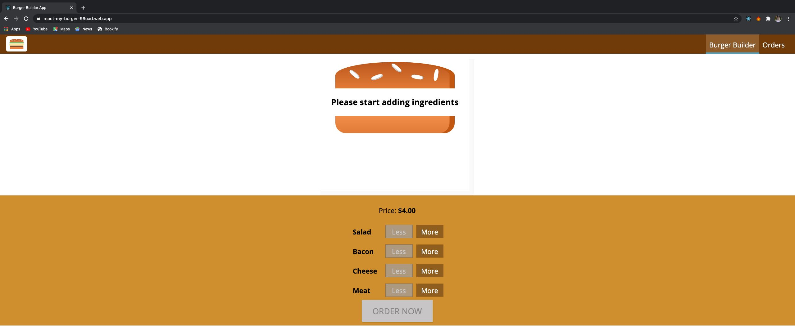

## Burger Ordering Application w/ ReactJS
A burger ordering application made using React JS which enables users to make a personalised burger of their liking and lets them place the order.
##
</img>
##

### What I used? 🤔

- React 16 / Jsx pages
- React Router
- Axios
- Webpack
- Babel
- Vanilla JavaScript
- HTML5
- CSS3 w/ Mobile First approach
- FireBase for Database and Hosting

## How to setup Start? ⚙️

<pre>npm install</pre>
then
<pre>npm start</pre>

## Deployment 🚀

### The deployed 👉 <a href="https://react-my-burger-99cad.web.app/" target="_blank">App</a>: 

> This project is inspired by the amazing tutor Sir Maximilian Schwarzmüller.
#### License

MIT License